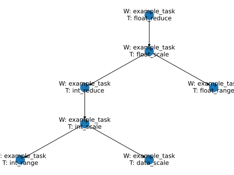

# Assignment 5 (16 p.)

In this assignment you finish core part of the STEM. you have to unite all previous part and implement system of task execution.

For to start, let set rules of meta forwarding. 

For example, consider next task tree:



And on the next example of meta:
```
{
    "a" : 1,
    "b" : 2,
    "int_reduce" : {
    }
    "float_scale" : {
        "int_reduce" : {
            "aa" : 10,
            "int_scale" : {
                "bb" : 10,
            }
        }        
    }
    "float_range" : {...}
}
```

In this example top-level metafields `a`, `b` , `int_reduce` forward to top-level task `float_reduce`, but metafields `float_scale` and `float_range` forward to children tasks `float_scale` and `float_range` respectively. Content of `float_scale` distributed in the same way.

1. (6 p.) In module `task_tree.py` implement the method  `resolve_node(self, task: Task[T], workspace: Optional[IWorkspace] = None) -> TaskNode[T]:` of the class `TaskTree` and properties `dependencies`, `is_leaf`, `unresolved_dependencies` and `has_dependence_errors` of the class `TaskNode`. Instance of `TaskTree` contain tree of tasks and its dependencies (or of dependencies error). Instance of `TaskNode` is node of this tree. Method `resolve_node` accept the task and the workspace (optional if `workspace` is `None` using default workspace of the task) and return `TaskNode` instance which contain the task and `TaskNode` instances for resolving dependencies (returned by `dependecies` property), names of unresolving dependecies (returned by `unresolved_dependencies` properties). The property `is_leaf` return `True` if the task doesn't have dependencies. The property `has_dependence_errors` return `True` if current node or any child node (on any level) have unresolving dependence.
2. (2 p.) In module `task_runner.py` implement the method `run(self, meta: Meta, task_node: TaskNode[T]) -> T:` of the class `SimpleRunner`. This method run the method `task_node.task.transform` using the `meta` argument and result of invocation of the `transform` method from `task_node` dependencies. Content of the `meta` argument distributed by defined rules.
3. (3 p.) In module `task_master.py` implement the method `execute(self, meta: Meta, task: Task[T], workspace: Optional[Workspace] = None) -> TaskResult[T]:` of the class `TaskMaster`. This method implement next algorithm:
   1. Get the `TaskNode` instance for given `task` from existing or new `task_tree`.The method return `TaskResult` with `TaskStatus.DEPENDENCIES_ERROR` if the `TaskNode` instance has dependencies error.
   2. Verify metadata give in `meta` argument using `MetaVerification.verify`. Content of the `meta` argument distributed between tasks by defined rules. If metadata errors is presented, should be return `TaskResult` with `TaskStatus.META_ERROR` and `TaskMetaError` instance.
   3. Return `TaskResult` with `TaskStatus.CONTAINS_DATA` if dependencies or meta error is absent today. In argument `lazy_data` must be stored callable value which run invocation of the task in the `task_runner`.
4. (4 p.) In module `cli_main.py` was be implmented CLI for task run, but dark wizard `Volan-de-Mort` deleted code from git history. Fortunately, I save the help outputs of this CLI. Restore content of `cli_main.py` using this outputs.
```
harry@hogwarts: python cli_main.py --help
usage: cli_main.py [-h] [-w WORKSPACE] command ...

Run task in workspace

positional arguments:
  command
    structure           Print workspace structure
    run                 Run task

options:
  -h, --help            show this help message and exit
  -w WORKSPACE, --workspace WORKSPACE
                        Add path to workspace or file for module workspace

```
```
harry@hogwarts: python cli_utils.py structure --help
usage: cli_utils.py structure [-h]

options:
  -h, --help  show this help message and exit

```
```
harry@hogwarts: python cli_utils.py run --help
usage: cli_utils.py run [-h] [-m META] TASKPATH

positional arguments:
  TASKPATH

options:
  -h, --help            show this help message and exit
  -m META, --meta META  Metadata for task or path to file with metadata in JSON format
```
5. (1 p.) Using `setup.py` (or `toml` file) create console script for call `stem.cli_main:stem_cli_main` function.